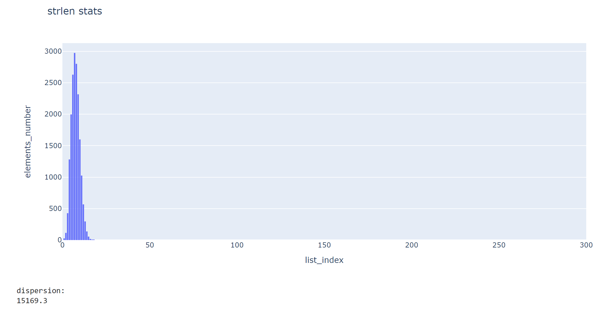
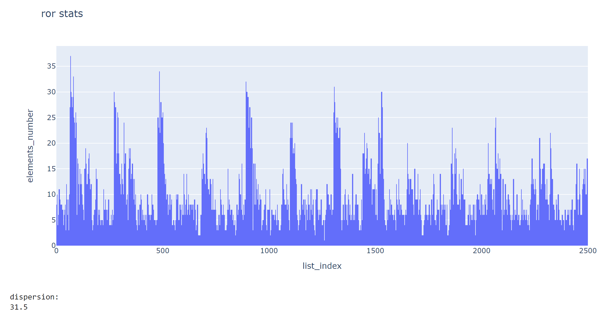
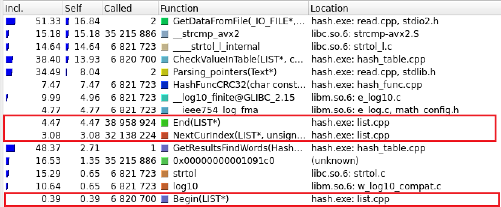

# Хеш-таблица
## Описание проекта  
В данной проекте проводится два этапа работы:  
- **Исследование Хеш-функций** - сравнение различных хеш-функций по нескольким параметрам.
- **Оптимизация функций** - профилирование программы и ускорение нужного объекта оптимизации.
## Структура данных Хеш-таблица
Хеш-таблица - это структура данных, хранящая пары элементов ключ-значение. В нашем случае ключами являются английские слова. В данной реализации хеш-таблица представляет из себя массив двусвязных списков, индексы которого соответствуют результату хеш-функции (обратите внимание на пункт `Note` ниже). Выполняет три основные операции: добавление, удаление и поиск ключа в таблице. Мы определяем функцию хеширования, которая по каждому входящему элементу будет определять натуральное число. А уже дальше по этому натуральному числу мы будем класть элемент в двусвязный список (его реализация также представлена в данном репозитории), тем самым заполняя хеш-таблицу.   

Иногда возникает проблема, когда хеш-функция выдает одинаковое натуральное число для разных элементов. Такая ситуация называется коллизией. Ниже представлена картинка, которая отображает вышеизложенную информацию. 


> [!NOTE]
> Результат хеш-функции берется по модулю размера таблицы. В даннной реализации размер хеш-таблицы простое число. Это нужно для того, чтобы получить более случайное распределение ключей.

### Фактор загрузки
Фактор загрузки это отношение количества элементов к размеру хеш-таблицы, то есть ожидаемое количество элементов в одной ячейке таблицы. В данном проекте для анализа взято произведение ```"Война и Мир"``` (в английском переводе), хранящее в себе 18257 уникальных слов, а также ни одного слова длиной больше 32 букв (важно при выполнении второй части данной работы). При обработке текста были "выброшены" все знаки препинания, а также слова приведены к строчному виду. В данном исследовании функций был подобраный такой размер хеш-таблицы (```2551```), чтобы коэффицент загрузки составлял примерно ```7```. Это нужно, чтобы было лучше видно неравномерность распределения. В реальных задачах он составляет примерно ```0.75-1.5```.

## Исследование Хеш-функций
Распределение хеш-функций будут визуализированы с помощью гистограмм. По горизонтали номер списка в таблице, А по вертикали количество элементов в соответствующем списке. А критерием сравнения функций будет являться ```дисперсия```, так как она определяет среднюю длину списка. Поэтому чем меньше ее значение, тем лучше функция.   
> [!NOTE]
> В скобках будут указаны краткие обозначения функций, которые будут использоваться дальше. 
### Функция, возвращающая константу (constant)
В данном случае всегда возвращается число 5.


### Функция, возвращающая ASCII код первого символа слова (word[0])


### Функция, возвращающая длину слова (strlen)



### Функция, возвращающая сумму ASCII кодов слова
Данная функция будет исследована при стандартном размере хеш-таблицы (**ascii1**) и при размере ```239``` (**ascii2**). Для второго из них значение коэффицента загрузки составляет приблизительно 76. 


Из гистограммы может показаться, что данная хеш-функция является "хорошей" поскольку мы видим достаточно равномерное распределение. Но теперь исследуем эту функцию при стандартном размере таблицы.  


Мы видим, что в этом случае уже нет никакого равномерного распределения. Это связано с огранниченостью длины английский слов. Так как коды маленьких английских букв лежат в диапазоне от 97 до 122, то при большом размере хеш-таблицы в последних ячейках уже не будет находиться элементов.  
Однако, можно заметить, что среди четырех представленных функций, она является лучшей, поскольку значение дисперсии является самым маленьким.

### Функция, возвращающая сумму ASCII кодов слова, деленную на длину (sumdivlen)


### Функция с использованием циклического сдвига вправо (Ror)
Алгоритм данной хеш-функции следующий: В цикле выполняется циклический сдвиг значения хеша вправо на 1 бит, после этого делается ```xor``` с текущим символом слова. Полученное значение становится новым для хеша. Количество итераций цикла равняется длине слова.



### Функция с использованием циклического сдвига влево (Rol)
Алгоритм аналогичен **Ror**, только сдвиг происходит влево.


Данные хеш-функции уже значительно лучше предыдущих, так как показатель дисперсии меньше. Но можно отметить, что **Rol** является предпочтительнее.

### Интересное замечание
В языке C нет команд циклического сдвига. Но современные компиляторы производят ```backend``` оптимизацию. То есть написанная функция циклического сдвига, например Rol, с включенным уровнем оптимизации -O3 будет распознана компилятором и заменена в одну команду.


### Функция Crc-32
Об алгоритме данной хеш-функции можно прочитать здесь [`Crc-32`](https://ru.wikipedia.org/wiki/Crc)


## Анализ полученных результатов
Представим значения дисперсий в таблице


| Функция\Параметр          |   Дисперсия   |
|:--------------------------|:-------------:|
|**constant**               | 130661.72     |
|**word[0]**                | 7536.28       |
|**strlen**                 | 15169.32      |
|**ascii2**                 | 173.83        | 
|**ascii1**                 | 588.61        | 
|**sumdivlen**              | 12216.65      | 
|**Ror**                    | 31.46         | 
|**Rol**                    | 10.43         |
|**Crc-32**                 | 7.38          |

Среди исследованных функций лучшей является **Crc-32**. Этот результат является ожидаемым, поскольку данный алгоритм используется на практике, например в протоколах передачи данных. Во второй части данного проекта будем использовать именно эту хеш-функцию.
## Оптимизации функций

Нашей главной задачей является оптимизация функции поиска. При этом в рамках данного проекта нужно использовать оптимизацию с помощью ассемблерной вставки, интринсик функций и кода, полностью написанного на ассемблере.
Начальные данные:
 - Количество слов для поиска 6,748,240
 - Количество слов в таблице 7,161
 - Load factor: 7.03
 - Размер хеш-таблицы: 1019
   
Первый пункт из входных данных нам особенно понадобится в оптимизации хеш-функции.

### DEBUG версия программы
В данной версии программы содержатся верификаторы. Как мы можем видеть из картинки ниже именно функции ```ListVerify``` и ```TableVerify``` имеют наибольшие затраты. 


 - **Функция Поиска** - 4,795,105,506  CPU ticks
 - **Вся программа** -  11,709,608,435 CPU ticks

### OPTIMIZATION WITHOUT ASM версия программы
В первую очередь выключим верификаторы. А также можно заметить в поиске использование функций ```End```, ```NextCurIndex```, ```Begin```.  



Они просто возвращают значение соответствующего индекса и используются в цикле. Например:
~~~ C++

iterator_t Begin(LIST* list)
    {
    return list->front;
    }

~~~

Но вызовы этих функций ухудшают производительность программы. Поэтому сначала заинлайним их. Видим, что количество тиков процессора намного уменьшилось (полная статистика представлена в конце данного раздела).

 - **Функция Поиска** - 3,418,126,242 CPU ticks
 - **Вся программа** -  7,282,880,179 CPU ticks

### BASE версия программы
Ну и наконец скомпилируем нашу программу с флагами ```-g -mavx2 -O2``` и получим версию программы, которую мы и будем оптимизировать с использованием ассемблерных вставок.

 - **Функция Поиска** - 1,832,850,470 CPU ticks
 - **Вся программа** -  4,527,516,884 CPU ticks

На картинке ниже мы можем видеть основные функции, участвующие в поиске слов. Это функция ```strcmp``` (17.52%)  и сама функция хеширования (8.62%). Именно их мы и будем оптимизировать.


## Оптимизация хеш-функции
Нашу реализацию CRC-32 можно оптимизировать различными способами:
 - **Ассемблерная вставка инструкции crc32**
 - **Использование интринсика _mm_crc32_u8**
 - **Аналогичной функции, полностью напиcанной на ассемблере**

Но я решил проверить, какой из этих способов окажется наиболее эффективным. Поэтому при помощи программы ```objdump```, которая предназначена для исследования скомпилированных файлов, посмотрим во что раскрывается каждый из этих способов. Для начала сравним использование интринсика и аналогичной функции, полностью написанной на ассемблере.


Как мы видим, моя реализация на ассемблере (```FuncCrc32```) имеет на 3 инструкции меньше, чем функция, в которую включен интринсик.

> [!NOTE]
> В начале функции, в которую включен интринсик, используется инструкция ```endbr64```, прочитать про которую можно здесь [`Indirect Branch Tracking`](https://edc.intel.com/content/www/us/en/design/ipla/software-development-platforms/client/platforms/alder-lake-desktop/12th-generation-intel-core-processors-datasheet-volume-1-of-2/010/indirect-branch-tracking/)

Теперь давайте сравним ассемблерную вставку и аналогичную функции, написанную на ассемблере.


Опять же можно видеть, что используется инструкция ```endbr64```. И если сравнить отчет ```valgrind``` о времени, затраченной программой. 

**Для ассемблерной вставки:**


 - **Функция Поиска** - 1,654,599,543 CPU ticks
 - **Вся программа** -  4,334,419,874 CPU ticks

**Для функции, написанной на ассемблере:**


 - **Функция Поиска** - 1,647,851,303 CPU ticks
 - **Вся программа** -  4,327,598,151 CPU ticks

То разница тиков, затраченная на функцию поиска, составит как раз значение количества слов, которые участвовали в поиске.  
И все же ассемблерная вставка является предпочтительнее:   
 - Во-первых, нет необходимости ассемблировать и линковать отдельный файл.  
 - Во-вторых, используется меньшее количество ассемблерного кода, что улучшает понимание программы.
~~~ C++
hash_t HashFuncInlineCRC32(const char* word, size_t lenght_word)
    {
    hash_t hash = 0xFFFFFFFF;

    while (*word)
        {
        asm ("crc32 %0, %1" 
            :"=r"(hash) 
            :"r"(*word++), "r"(hash)
            );
        }

    return hash;
    }
~~~

## Оптимизация strcmp + все предыдущие
Для оптимизации strcmp мы будем использовать векторные инструкции AVX2. Для начала нам нужно выравнить входные данные по 32 байта (это нужно для параллелизма). Также из входных данных известно, что нет слова длиной больше 32 букв. 


Как мы видим, получено значительно ускорение функции поиска слов.   

 - **Функция Поиска** - 788,179,485 CPU ticks
 - **Вся программа** -  3,881,178,314 CPU ticks

Но сам код программы стал выглядеть менее понятным.

~~~ C++
iterator_t CheckValueInTable(LIST* list, List_type avx_key, size_t lenght_word) 
    {
    iterator_t i = list->front;

    while (i != list->data[list->front].prev) 
        {
        if (_mm256_movemask_epi8(_mm256_cmpeq_epi8(avx_key, list->data[i].value)) == -1)                            
            return i;

        i = list->data[i].next;
        }

    return 0;
    }
~~~

## Результаты
### Функция Поиска
<table>
    <thead>
        <tr>
          <th style="text-align: center" rowspan=2>Версия программы</th>
        </tr>
        <tr>
            <th style="text-align: center">CPU ticks</th>
            <th style="text-align: center">ускорение от BASE</th>
            <th style="text-align: center">ускорение от предыдущего</th>
        </tr>
    </thead>
    <tbody>
        <tr>
            <td>DEBUG</td>
            <td style="text-align: center">4,795,105,506</td>
            <td style="text-align: center">-</td>
            <td style="text-align: center">-</td>
        <tr>
          <tr>
            <td>OPTIMIZATION WITHOUT ASM</td>
            <td style="text-align: center">3,418,126,242</td>
            <td style="text-align: center">-</td>
            <td style="text-align: center">1.403</td>
        <tr> 
          <tr>
            <td>BASE</td>
            <td style="text-align: center">1,832,850,470</td>
            <td style="text-align: center">1</td>
            <td style="text-align: center">1.865</td>
        <tr> 
        <tr>
            <td>INLINE CRC-32</td>
            <td style="text-align: center">1,654,599,543</td>
            <td style="text-align: center">1.108</td>
            <td style="text-align: center">1.108</td>
        <tr> 
          <tr>
            <td>CRC-32 ASM</td>
            <td style="text-align: center">1,647,851,303</td>
            <td style="text-align: center">1.112</td>
            <td style="text-align: center">1.004</td>
        <tr> 
          <tr>
            <td>STRCMP + CRC-32 ASM</td>
            <td style="text-align: center">788,179,485</td>
            <td style="text-align: center">2.325</td>
            <td style="text-align: center">2.091</td>
    </tbody>
</table>

### Вся программа
<table>
    <thead>
        <tr>
          <th style="text-align: center" rowspan=2>Версия программы</th>
        </tr>
        <tr>
            <th style="text-align: center">CPU ticks</th>
            <th style="text-align: center">ускорение от BASE</th>
            <th style="text-align: center">ускорение от предыдущего</th>
        </tr>
    </thead>
    <tbody>
        <tr>
            <td>DEBUG</td>
            <td style="text-align: center">11,709,608,435</td>
            <td style="text-align: center">-</td>
            <td style="text-align: center">-</td>
        <tr>
          <tr>
            <td>OPTIMIZATION WITHOUT ASM</td>
            <td style="text-align: center">7,282,880,179</td>
            <td style="text-align: center">-</td>
            <td style="text-align: center">1.608</td>
        <tr> 
          <tr>
            <td>BASE</td>
            <td style="text-align: center">4,527,516,884</td>
            <td style="text-align: center">1</td>
            <td style="text-align: center">1.609</td>
        <tr> 
          <tr>
            <td>INLINE CRC-32</td>
            <td style="text-align: center">4,334,419,874</td>
            <td style="text-align: center">1.045</td>
            <td style="text-align: center">1.045</td>
        <tr> 
          <tr>
            <td>CRC-32 ASM</td>
            <td style="text-align: center"> 4,327,598,151</td>
            <td style="text-align: center">1.046</td>
            <td style="text-align: center">1.002</td>
        <tr> 
          <tr>
            <td>STRCMP + CRC-32 ASM</td>
            <td style="text-align: center">3,881,178,314</td>
            <td style="text-align: center">1.167</td>
            <td style="text-align: center">1.116</td>
    </tbody>
</table>

## Итог
Нам удалось ускорить функцию поиска в 2.325, что является отличным результатом. Используя такие инструменты, как ```valgrind``` и ```objdump```, можно находить нужные объекты оптимизации и  даже ускорять программу, уже скомпилированную с уровнем оптимизации -O2.  
