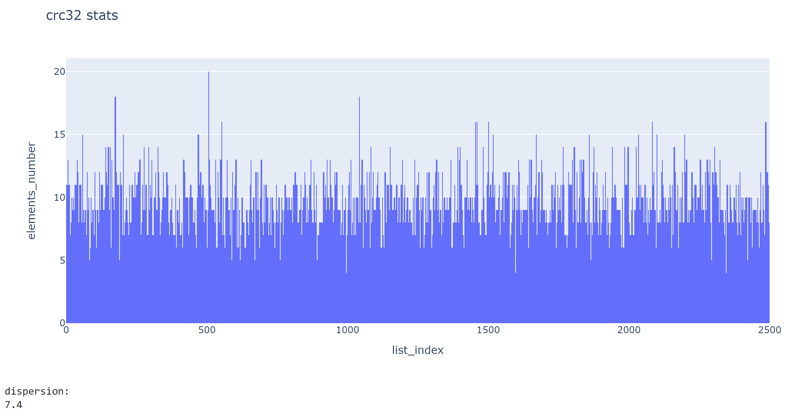
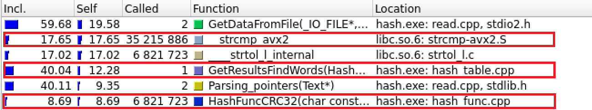

# Хеш-таблица
## Описание проекта  
В данном проекте проводится два этапа работы:  
- Сравнение различных хеш-функций по равномерности распределения элементов в хеш-таблице.
- Профилирование программы и оптимизация функции поиска элемента в хеш-таблице с использованием минимального количества платформозависимого кода.
## Структура данных Хеш-таблица
В данной реализации хеш-таблица представляет из себя массив двусвязных списков, индексы которого соответствуют результату хеш-функции (обратите внимание на пункт `Note` ниже). Выполняет три основные операции: добавление, удаление и поиск элемента в таблице. Мы определяем функцию хеширования, которая по каждому входящему элементу будет определять натуральное число. А уже дальше по этому натуральному числу мы будем класть элемент в двусвязный список (его реализация также представлена в данном репозитории), тем самым заполняя хеш-таблицу.   

Иногда возникает проблема, когда хеш-функция выдает одинаковое натуральное число для разных элементов. Такая ситуация называется коллизией. Для решения этой проблемы в нашем проекте мы будем производить линейный поиск по соответствующему списку, что позволяет находить нужный элемент даже при коллизии.  

Ниже представлена картинка, которая отображает вышеизложенную информацию. 


> [!NOTE]
> Результат хеш-функции берется по модулю размера таблицы. В даннной реализации размер хеш-таблицы простое число. Это нужно для того, чтобы получить более случайное распределение элементов.

### Фактор загрузки
Фактор загрузки это отношение количества элементов к размеру хеш-таблицы, то есть ожидаемое количество элементов в одной ячейке таблицы. При равномерном распределении от этого коэффицента напрямую будет зависить скорость поиска элементов в хеш-таблице.   
  
В данном проекте для анализа взято произведение ```"Война и Мир"``` (в английском переводе), хранящее в себе 18257 уникальных слов, а также ни одного слова длиной больше 32 букв (важно при выполнении второй части данной работы). При обработке текста были "выброшены" все знаки препинания, а также слова приведены к строчному виду. В данном исследовании функций был подобраный такой размер хеш-таблицы (```2551```), чтобы коэффицент загрузки составлял примерно ```7```. Это нужно, чтобы было лучше видно неравномерность распределения. В реальных задачах он составляет примерно ```0.5-1.5```.

## Исследование Хеш-функций
Распределение хеш-функций будут визуализированы с помощью гистограмм. По горизонтали номер списка в таблице, А по вертикали количество элементов в соответствующем списке. А критерием сравнения функций будет являться ```дисперсия```, так как она определяет среднюю длину списка. Поэтому чем меньше ее значение, тем лучше функция.   
> [!NOTE]
> В скобках будут указаны краткие обозначения функций, которые будут использоваться дальше. 
### Функция, возвращающая константу (constant)
В данном случае всегда возвращается число 5.


### Функция, возвращающая ASCII код первого символа слова (word[0])


### Функция, возвращающая длину слова (strlen)


### Функция, возвращающая сумму ASCII кодов слова
Данная функция будет исследована при стандартном размере хеш-таблицы (**ascii1**) и при размере ```239``` (**ascii2**). Для второго из них значение коэффицента загрузки составляет приблизительно 76. 


Из гистограммы может показаться, что данная хеш-функция является "хорошей" поскольку мы видим достаточно равномерное распределение. Но теперь исследуем эту функцию при стандартном размере таблицы.  


Мы видим, что в этом случае уже нет никакого равномерного распределения. Это связано с огранниченостью длины английский слов. Так как коды маленьких английских букв лежат в диапазоне от 97 до 122, то при большом размере хеш-таблицы в последних ячейках уже не будет находиться элементов.  
Однако, можно заметить, что среди четырех представленных функций, она является лучшей, поскольку значение дисперсии является самым маленьким.

### Функция, возвращающая сумму ASCII кодов слова, деленную на длину (sumdivlen)


### Функция с использованием циклического сдвига вправо (Ror)
Алгоритм данной хеш-функции следующий: В цикле выполняется циклический сдвиг значения хеша вправо на 1 бит, после этого делается ```xor``` с текущим символом слова. Полученное значение становится новым для хеша. Количество итераций цикла равняется длине слова.


### Функция с использованием циклического сдвига влево (Rol)
Алгоритм аналогичен **Ror**, только сдвиг происходит влево.


Данные хеш-функции уже значительно лучше предыдущих, так как показатель дисперсии меньше. Но можно отметить, что **Rol** является предпочтительнее.

### Интересное замечание
В языке C нет команд циклического сдвига. Но современные компиляторы производят ```backend``` оптимизацию. То есть написанная функция циклического сдвига, например Rol, с включенным уровнем оптимизации -O3 будет распознана компилятором и заменена в одну команду.


### Функция Crc-32
Об алгоритме данной хеш-функции можно прочитать здесь [`Crc-32`](https://ru.wikipedia.org/wiki/Crc)



## Анализ полученных результатов
Представим значения дисперсий в таблице


| Функция\Параметр          |   Дисперсия   |
|:--------------------------|:-------------:|
|**constant**               | 130662        |
|**strlen**                 | 15169         |
|**sumdivlen**              | 12217         | 
|**word[0]**                | 7536          |
|**ascii1**                 | 589           | 
|**ascii2**                 | 174           | 
|**Ror**                    | 31.5          | 
|**Rol**                    | 10.4          |
|**Crc-32**                 | 7.4           |

Среди исследованных функций лучшей является **Crc-32**. Этот результат является ожидаемым, поскольку данный алгоритм используется на практике, например в протоколах передачи данных. Во второй части данного проекта будем использовать именно эту хеш-функцию.

## Оптимизации функций

Нашей главной задачей является оптимизация функции поиска. При этом в рамках данного проекта нужно использовать оптимизацию с помощью ассемблерной вставки, интринсик функций и кода на ассемблере, написанного в отдельном файле.  

Начальные данные:
 - Количество слов для поиска: 6,748,240
 - Размер хеш-таблицы: 1024
   
Первый пункт из входных данных нам особенно понадобится в оптимизации хеш-функции.  
Взятие именно такого размера не повлияет на равномерность распределения элементов в хеш-таблице. Поскольку, функция ```crc-32``` (из анализа в первой части работы) является хорошей, а значит будет иметь равномерное распределение независимо от размера таблицы. К доказательству к этому приведу гистограмму с размером таблицы 1024 (причина, почему размер таблицы является степенью двойки, будет объяснена позже).


Профилирование программы будет производиться с помощью ```callgrind```. Результатом измерения является ```Instruction refs``` (в дальнейшем Ir), то есть количество выполненных инструкций. Поэтому погрешности измерений, в зависимости от дополнительной нагрузки процессора, не будет.  

### DEBUG версия программы
В данной версии программы содержатся верификаторы. Как мы можем видеть из картинки ниже именно функции ```ListVerify``` и ```TableVerify``` имеют наибольшие затраты.


Поэтому в первую очередь выключим верификаторы, а также будем компилировать нашу программу с флагами ```-g -mavx2 -O2```.

### Оптимизация без использования платформозависимового кода (WITHOUT ASM)
В отчете ```callgrind``` можно заметить использование функций ```End```, ```NextCurIndex``` и ```Begin```.  


Они просто возвращают значение соответствующего индекса и используются в цикле при поиске элемента в таблице. Например:
~~~ C++

iterator_t NextCurIndex(LIST* list, size_t index)
    {
    return list->data[index].next;
    }

iterator_t CheckValueInTable(LIST* list, const char* word, size_t lenght_word) 
    {
    iterator_t i = Begin(list);

    while (i != End(list)) 
        {
        if (strcmp(word, list->data[i].value) == 0)                            
            return i;

        i = NextCurIndex(list, i);
        }

    return 0;
    }
~~~

Время выполнения такой программы в количетсве выполненных инструкций:  

| Объект                    |   Ir * 10^6   | Ускорение от предыдущей версии | Ускорение от BASE версии |
|:-------------------------:|:-------------:|:------------------------------:|:------------------------:|
|Вся программа              |   5223        |                -               |            -             |
|Функция поиска             |   2527        |                -               |            -             |

Но вызовы этих функций ухудшают производительность программы. Поэтому заинлайним их.

| Объект                    |   Ir * 10^6   | Ускорение от предыдущей версии | Ускорение от BASE версии |
|:-------------------------:|:-------------:|:------------------------------:|:------------------------:|
|Вся программа              |   4493        |                1.16            |            -             |
|Функция поиска             |   1799        |                1.41            |            -             |

Получено значительное ускорение функции поиска.

### BASE версия программы
Последняя версия программы, полученная в предыдущем пункте как раз и будет являться той, которую мы и будем оптимизировать с использованием платформозависимого кода.

На картинке ниже мы можем видеть основные функции, участвующие в поиске слов. Это функция ```strcmp``` (17.65%),  функция поиска слов ```GetResultFindWords``` (12.28%) и функция хеширования ```HashFuncCrc32``` (8.62%). Именно их мы и будем ускорять.  

Также можно заметить, что не малую часть работы программы занимают функции ```GetDataFromFile```, ```strtol``` и ```Parsing_pointers```. Но эти функции не участвуют в поиске, а используются для обработки данных из файла. Поэтому их подвергать оптимизации не будем.



## Оптимизация strcmp
Для оптимизации strcmp мы будем использовать векторные инструкции AVX2. Для начала нам нужно выравнить входные данные по 32 байта (это нужно для параллелизма).

Как можно видеть из картинки ниже, функция ```strcmp``` отсутсвует в отчете ```callgrind```, поскольку мы ее заменили на соответствующие интринсики.


В результате, получено значительно ускорение функции поиска слов.   

| Объект                    |   Ir * 10^6   | Ускорение от предыдущей версии | Ускорение от BASE версии |
|:-------------------------:|:-------------:|:------------------------------:|:------------------------:|
|Вся программа              |   3998        |                1.12            |            1.12          |
|Функция поиска             |   904         |                1.99            |            1.99          |

Но сам код программы стал выглядеть менее понятным.
~~~ C++
iterator_t CheckValueInTable(LIST* list, List_type avx_key, size_t lenght_word) 
    {
    iterator_t i = list->front;

    while (i != list->data[list->front].prev) 
        {
        if (_mm256_movemask_epi8(_mm256_cmpeq_epi8(avx_key, list->data[i].value)) == -1) // strcmp(word, list->data[i].value) == 0                           
            return i;

        i = list->data[i].next;
        }

    return 0;
    }
~~~

## Проблема Оптимизации функции GetResultFindWords
Почему же оптимизация данной функции является проблемой? Ответ на этот вопрос будет получен в течение данного раздела.   

Cам код этой функции выглядит следующим образом:  

~~~ C++
size_t GetResultsFindWords(HashTable* hash_table, Text* data)
    {
    CHECK_HASH_TABLE_ERROR(hash_table);

    size_t find_words = 0;

    char* ptr = data->aligned_Buf;

    for (size_t i = 0; i < data->count_n; i++)
        {
        find_words += (HashTableSearch(hash_table, ptr, (data->str + i)->length));
        ptr += 32;
        }

    CHECK_HASH_TABLE_ERROR(hash_table);

    return find_words;
    }
~~~

Но компилятор, если сравнить отчет ```callgrind``` при компиляции с -O2 и без него, инлайнит функции ```HashTableSearch``` и ```CheckValueInTable``` с -O2, которые являются дочерними для данной. Поэтому количество исполняемых инструкций ```GetResultFindWords``` настолько велико. Соответсвенно, оптимизировать можно любую из них. Но если проанализировать эти функции, то можно заметить, что большую часть занимают циклы и присваивания.

~~~ C++
iterator_t CheckValueInTable(LIST* list, List_type avx_key, size_t lenght_word) 
    {
    iterator_t i = list->front;

    while (i != list->data[list->front].prev) 
        {
        if (_mm256_movemask_epi8(_mm256_cmpeq_epi8(avx_key, list->data[i].value)) == -1)                            
            return i;

        i = list->data[i].next;
        }

    return 0;
    }


bool HashTableSearch(HashTable* hash_table, const char* word, size_t lenght_word)
    {
    hash_t hash_value = hash_table->hash_function(word, lenght_word) % HASH_TABLE_CAPACITY;

    List_type key = _mm256_load_si256((List_type*)word);

    if (!CheckValueInTable(&hash_table->list[hash_value], key, lenght_word))  
        return false;                                                                      

    return true;
    }
~~~

Мною были найдены 2 объекта оптимизации, которые включены в данные функции.

### Оптимизация %
В языке С взятие остатка от деления выполняется при помощи оператора %. Такой метод позволяет обрабатывать любые размеры таблиц, однако, **предполагается**, что плох излишними затратами времени. Как раз здесь нам и понадобится, что размер хеш-таблицы является степенью двойки. Поскольку можно использовать ассемблерную вставку с использованием ```and``` для взятия остатка от деления:

~~~ C++
bool HashTableSearch(HashTable* hash_table, const char* word, size_t lenght_word)
    {
    hash_t hash_value = hash_table->hash_function(word, lenght_word);

    asm ("and %0, %1" 
            :"=r"(hash_value) 
            :"r"((hash_t) HASH_TABLE_CAPACITY - 1), "r"(hash_value)
        );

    List_type key = _mm256_load_si256((List_type*)word);

    if (!CheckValueInTable(&hash_table->list[hash_value], key, lenght_word))  
        return false;                                                                      

    return true;
    }
~~~

Давайте же посмотрим отчет ```callgrind``` с использованием ассемблерной вставки:

| Объект                    |   Ir * 10^6   | Ускорение от предыдущей версии | Ускорение от BASE версии |
|:-------------------------:|:-------------:|:------------------------------:|:------------------------:|
|Вся программа              |   4011        |                0.997           |            1.11          |
|Функция поиска             |   917         |                0.985           |            1.98          |

Мы видим, что результаты оказались даже хуже, чем предыдущая версия с использованием %. Но почему же так произошло? Дело в том, что современные компиляторы с флагом -O2 сами понимают, что можно использовать инструкцию ```and```. Поэтому наша оптимизация не является успешной.


 ### Оптимизация присваивания
 Здесь я решил сооптимизировать присваивание результата поиска слова (то есть увеличение счетчика на единицу) с использованием ассемблерной вставки ```inc```, вместо инструкции ```add```.   


   
 Но почему же это должно дать прибавку в скорости? Дело в том, что команда ```inc``` работает быстрее, чем команда ```add```, поскольку в команде ```inc``` не указывается второй операнд. Поэтому чтение из памяти команды ```inc``` выполняется быстрее, чем чтение из памяти команды ```add```.
 
Функция поиска стала выглядеть следующим образом:  

~~~ C++
size_t GetResultsFindWords(HashTable* hash_table, Text* data)
    {
    CHECK_HASH_TABLE_ERROR(hash_table);

    size_t find_words = 0;

    char* ptr = data->aligned_Buf;

    for (size_t i = 0; i < data->count_n; i++)
        {
        if (HashTableSearch(hash_table, ptr, (data->str + i)->length))
            {
            asm ("inc %0" 
            :"=r"(find_words) 
            :"r"(find_words)
            );
            }

        ptr += 32;
        }

    CHECK_HASH_TABLE_ERROR(hash_table);

    return find_words;
    }
~~~

Теперь посмотрим отчет ```callgrind``` с использованием ассемблерной вставки:

| Объект                    |   Ir * 10^6   | Ускорение от предыдущей версии | Ускорение от BASE версии |
|:-------------------------:|:-------------:|:------------------------------:|:------------------------:|
|Вся программа              |   4001        |                0.999           |            1.12          |
|Функция поиска             |   907         |                0.997           |            1.99          |

Видим, что результат все равно хуже. На самом деле, он является очевидным, поскольку, как уже упоминалось ранее  ```callgrind``` измеряет количество выполненных инструкций. И при замене ```inc``` на ```add``` ничего бы не изменилось. А увеличение количества инструкций связано с тем, что нам пришлось написать условие того, что слово было найдено.

Как итог, я не смог сооптимизировать данную функцию, поэтому и назвал ее проблемной для оптимизацией. 

## Оптимизация CRC-32 + strcmp
Нашу реализацию CRC-32 можно оптимизировать двумя способами:
 - **Ассемблерная вставка инструкции crc32 (INLINE CRC-32)**
 - **написание функции на ассемблере в отдельном файле (CRC-32 ASM)**

Но я решил проверить, какой из этих способов окажется наиболее эффективным. Поэтому при помощи программы ```objdump```, которая предназначена для исследования скомпилированных файлов, посмотрим, во что раскрывается каждый из этих способов.


Данные функции идентичны, за исключением того, что в начале функции, в которую включена ассемблерная вставка, используется инструкция ```endbr64```, прочитать про которую можно здесь [`Indirect Branch Tracking`](https://edc.intel.com/content/www/us/en/design/ipla/software-development-platforms/client/platforms/alder-lake-desktop/12th-generation-intel-core-processors-datasheet-volume-1-of-2/010/indirect-branch-tracking/)

И если сравнить отчет ```callgrind``` о времени, затраченной программой. 

**Для ассемблерной вставки:**

| Объект                    |   Ir * 10^6   | Ускорение от предыдущей версии | Ускорение от BASE версии |
|:-------------------------:|:-------------:|:------------------------------:|:------------------------:|
|Вся программа              |   3852        |                1.04            |            1.176         |
|Функция поиска             |   759         |                1.19            |            2.41          |

**Для функции, написанной на ассемблере в отдельном файле:**

| Объект                    |   Ir * 10^6   | Ускорение от предыдущей версии | Ускорение от BASE версии |
|:-------------------------:|:-------------:|:------------------------------:|:------------------------:|
|Вся программа              |   3845        |                1.002           |            1.178         |
|Функция поиска             |   752         |                1.009           |            2.44          |

То разница выполненных инструкций, затраченная на функцию поиска, составит как раз значение количества слов, которые участвовали в поиске. То есть именно из-за ```endbr64``` получена разница в количестве выполняемых инструкций.  

После данных оптимизаций отчет ```callgrind``` выглядит следующим образом:


Функция ```GetResultFindWords``` занимает значимую часть выполнения программы, но как я и говорил раньше, мне не удалось ее сооптимизировать.

## Результаты

### Функция Поиска
<table>
    <thead>
        <tr>
          <th style="text-align: center" rowspan=2>Версия программы</th>
        </tr>
        <tr>
            <th style="text-align: center">Ir * 10^6</th>
            <th style="text-align: center">ускорение от BASE</th>
            <th style="text-align: center">ускорение от предыдущего</th>
        </tr>
    </thead>
    <tbody>
          <tr>
            <td>INITIAL</td>
            <td style="text-align: center">2527</td>
            <td style="text-align: center">-</td>
            <td style="text-align: center">-</td>
        <tr> 
          <tr>
            <td>WITHOUT ASM (BASE)</td>
            <td style="text-align: center">1799</td>
            <td style="text-align: center">-</td>
            <td style="text-align: center">1.41</td>
        <tr> 
        <tr>
            <td>STRCMP</td>
            <td style="text-align: center">904</td>
            <td style="text-align: center">1.99</td>
            <td style="text-align: center">1.99</td>
        <tr> 
          <tr>
            <td>INLINE CRC-32 + STRCMP</td>
            <td style="text-align: center">759</td>
            <td style="text-align: center">2.41</td>
            <td style="text-align: center">1.19</td>
        <tr> 
          <tr>
            <td>CRC-32 ASM + STRCMP </td>
            <td style="text-align: center">752</td>
            <td style="text-align: center">2.44</td>
            <td style="text-align: center">1.009</td>
    </tbody>
</table>

### Вся программа
<table>
    <thead>
        <tr>
          <th style="text-align: center" rowspan=2>Версия программы</th>
        </tr>
        <tr>
            <th style="text-align: center">Ir * 10^6</th>
            <th style="text-align: center">ускорение от BASE</th>
            <th style="text-align: center">ускорение от предыдущего</th>
        </tr>
    </thead>
    <tbody>
        <tr>
            <td>INITIAL</td>
            <td style="text-align: center">5223</td>
            <td style="text-align: center">-</td>
            <td style="text-align: center">-</td>
        <tr> 
        <tr>
            <td>WITHOUT ASM (BASE)</td>
            <td style="text-align: center">4493</td>
            <td style="text-align: center">-</td>
            <td style="text-align: center">1.16</td>
        <tr> 
        <tr>
            <td>STRCMP</td>
            <td style="text-align: center">3998</td>
            <td style="text-align: center">1.12</td>
            <td style="text-align: center">1.12</td>
        <tr> 
          <tr>
            <td>INLINE CRC-32 + STRCMP</td>
            <td style="text-align: center">3852</td>
            <td style="text-align: center">1.176</td>
            <td style="text-align: center">1.004</td>
        <tr> 
          <tr>
            <td>CRC-32 ASM + STRCMP </td>
            <td style="text-align: center">3845</td>
            <td style="text-align: center">1.178</td>
            <td style="text-align: center">1.002</td>
    </tbody>
</table>

## Итог
Нам удалось ускорить функцию поиска в 2.44, что является отличным результатом. Используя такие инструменты, как ```callgrind``` и ```objdump```, можно находить нужные объекты оптимизации и даже ускорять программу, уже скомпилированную с уровнем оптимизации -O2.  
Главным критерием оценки успеха оптимизации, как и говорилось в описании работы, является максимальное ускорение функции поиска с использованием минимального количетсва платформозависимого кода, поскольку он увеличивает сложность понимания программы. В связи с этим, предлагается оценить результат оптимизации, рассчитывая его по следующей формуле:   

**result = (прирост производительности / количество строк платформозависимого кода) * 1000**     

В данной работе он составил **result = (2.44 / 19) * 1000 = 128**.

