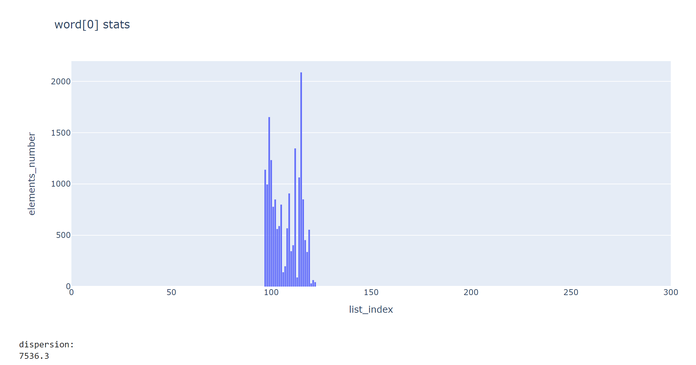
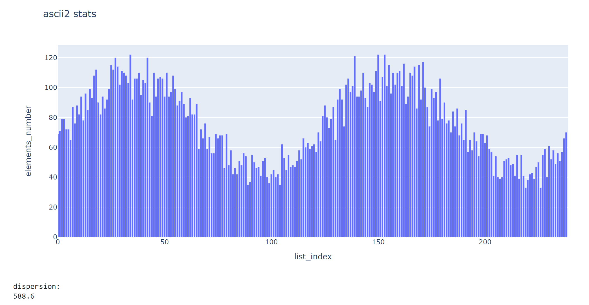

# Хеш-таблица
## Описание проекта  
В данной проекте проводится два этапа работы:  
- **Исследование Хеш-функций** - сравнение различных хеш-функций по нескольким параметрам.
- **Оптимизация функций** - профилирование программы и ускорение нужного объекта оптимизации.
## Исследование Хеш-функций
### Структура данных Хеш-таблица
Хеш-таблица - это структура данных, хранящая пары элементов (ключ, значение). В данной реализации она представляет из себя массив двусвязных списков, индексы которого соответствуют результату хеш-функции (обратите внимание на пункт `Note` ниже). Выполняет три основные операции: добавление, удаление и поиск ключа в таблице по значению. Мы определяем функцию хеширования, которая по каждому входящему элементу будет определять натуральное число. А уже дальше по этому натуральному числу мы будем класть элемент в двусвязный список (его реализация также представлена в данном репозитории), тем самым заполняя Хеш-таблицу.  

### Фактор загрузки
Фактор загрузки это отношение количества элементов к размеру Хеш-таблицы. В данной работе ключами являются иностранные слова из произведения `The Adventures of Tom Sawyer`, хранящее в себе 

> [!NOTE]
> В даннной реализации размер Хеш-таблицы простое число. Результат Хеш-функции берется по модулю размера таблицы.

| Функция\Параметр          |   Дисперсия   |
|:--------------------------|:-------------:|
|Returning a constant       | 130661.72     |
|Ascii code first letter    | 7536.28       |
|Word length                | 15169.32      |
|Сhecksum Ascii fisrt size  | 173.83        | 
|Сhecksum Ascii second size | 588.61        | 
|Checksum divided by length | 12216.65      | 
|Ror                        | 31.46         | 
|Rol                        | 10.43         |
|Crc-32                     | 7.38          |
